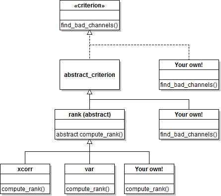

`criterion` package
===

In this document we will refer to this package as the `criterion` package
instead of its fully qualified name `meegpipe.node.bad_channels.criterion`.

The `criterion` package contains MATLAB classes implementing various bad channel
selection criteria. All such criteria implement the
[criterion interface][crit-ifc], which must also be implemented by any
user-defined criteria. Instructions on how to define our own selection criteria
can be found at the end of this document.

[crit-ifc]: ./criterion.md

## Available criteria


Criterion       | Description
--------------- | -------------
[var][var]      | Reject channels with very low or very large variance
[xcorr][xcorr]  | Reject channels with too low cross correlation with neighbouring channels
[bad_epochs][bad_epochs] | Reject channels that lead to many epoch rejections

[var]: ./+var/README.md
[xcorr]: ./+xcorr/REAMDE.md
[bad_epochs]: ./+bad_epochs/README.md

## Implementation details

The contents of this package are organized according to the following class
hierarchy:




## Define your own criteria

The only formal requirement for any user-defined criteria is to implement the
[criterion interface][crit-ifc]. However, it is often preferable to indirectly
implement the interface by inheriting from the abstract [rank][rank] criterion.
In this document we use the former approach to illustrate the process of
defining your own custom selection criterion. For information on how to define
custom criteria using the latter preferred approach see the documentation of
the [rank][rank] criterion.

[rank]: ./+rank/README.md

__Note__: There is a third approach of defining custom criteria, which consists
in inheriting from the `abstract_criterion` class (see the class hierarchy
above). This is not documented but the process is something in between what is
shown below and what is shown in the documentation of the [rank][rank]
criterion.

For illustration purposes, we will define a custom selection criterion that
ranks channels according to their channel index, and rejects some of the
top-ranked channels:

````matlab
    classdef dummy_crit < meegpipe.node.bad_channels.criterion.criterion

        properties
            NbChannels = 1; % The number of channels to reject. Use a default!
        end

        methods
            function [idx, rankVal] = find_bad_channels(obj, data)
                idx = 1:obj.NbChannels;
                rankVal = 1:size(data,1);
            end

            % Constructor
            function obj = dummy_crit(varargin)
                import misc.process_arguments;

                opt.NbChannels = 1; % By default reject only top-ranked channel
                [~, opt] = process_arguments(opt, varargin);

                obj.NbChannels = opt.NbChannels;

            end
        end

    end
````

And that's it. Of course it would be nice to have some consistency checks but
this is already a fully functional criterion that we can pass to the constructor
of a `bad_channels` node:


````matlab
    myNode = meegpipe.node.bad_channels.new(...
        'Criterion',      dummy_crit, ...
        'DataSelector',   pset.selector.sensor_class('Class', 'dummy'), ...
        'GenerateReport', false);

    % Create a sample physioset object, and test the node
    data = import(physioset.import.matrix, rand(10,1000));
    run(myNode, data);

    % This assertion should not generate an error and succeed
    assert(find(is_bad_channel(data)) == 1);
````

