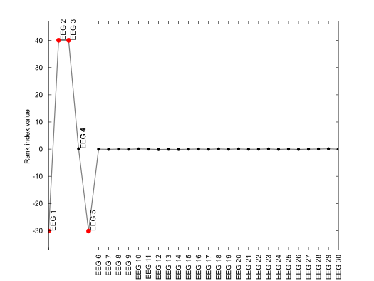
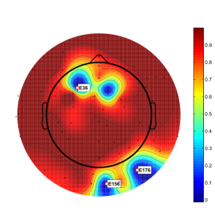
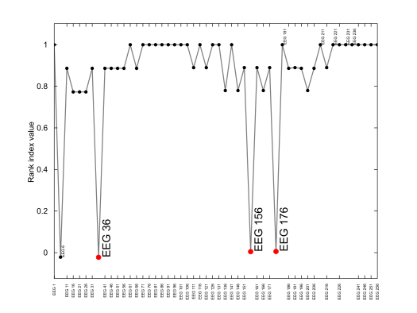

`bad_channels` - bad channels rejection node
====

The `bad_channels` node identifies bad channels based on a user-provided
rejection criterion. Several [pre-defined criteria][predef-crit] are
available and class users can easily define their own custom criteria.

[predef-crit]: ../+criterion/README.md

## Usage synopsis

````matlab
import meegpipe.node.*;
obj = bad_channels.new('key', value, ...);
data = run(obj, data);
````

where `data` is a [physioset][physioset] object.

[physioset]: ../../../+physioset/@physioset/README.md


## Construction arguments

The `bad_channels` node admits all the key/value pairs admitted by the
[abstract_node][abstract-node] class. For keys specific to this node
class see the documentation of the helper [config][config] class.

[abstract-node]: ../@abstract_node/README.md
[config]: ./config.md


## Methods

See the documentation of the [node API documentation][node].

[node]: ../


## Usage examples

All the examples below assume that _meegpipe_ has been initialized using:

````matlab
clear all;
meegpipe.initialize;
````

### Reject channels with large or too small variance

Channels with abnormally low or high variances can be rejected using criterion
[var][var]. The code snippet below illustrates a typical use case:

[var]: ./%2Bcriterion/%2Bvar

````matlab
% Generate some sample data. We need the data sensors to be of class EEG
% because the bad_channels node (by default) processes only EEG and MEG
% data. Any other data types (e.g. ECG data) are simply ignored by the node.
import physioset.import.matrix;

sensLabels = cellfun(@(x) num2str(x), num2cell(1:30), 'UniformOutput', false);
mySensors  = sensors.eeg('Label', sensLabels);
myImporter = matrix('Sensors', mySensors);
data = import(myImporter, randn(30, 10000));

% Channels 2 and 3 have very large variances
data([2, 3],:) = 100*data([2, 3], :);

% Channels 1 and 5 have very small variances
data([1 5], :) = eps*data([1 5], :);

% Build a criterion to reject channels with variance values at least two
% standard deviations away from the average channel variance
import meegpipe.node.bad_channels.criterion.var.var;
myCrit = var( ...
    'Percentile', [0 100], ...
    'Min',        @(x) mean(x) - 2*std(x), ...
    'Max',        @(x) mean(x) + 2*std(x) ...
);

% Use the criterion above to build a bad_channels node
import meegpipe.node.bad_channels.bad_channels;
myNode = bad_channels('Criterion', myCrit);

% Identify bad channels
run(myNode, data);

% The indices of the bad channels identified by the bad_channels node
idx = find(is_bad_channel(data));
assert(isempty(setdiff(idx, [1 2 3 5])))

````

Like any other node, the `bad_channels` node generates a HTML report
that can be used to inspect the decision process that took place behind
the scenes. In that report you will find images like the one shown below
which displays _rank index_ values for each channel. Channels with
rank indices that abnormally large or low are marked as being bad. Note
that the _rank index_ values are not just raw data variances but a
transformed version of such variances. To learn the details on how the
_rank index_ is obtained from raw data variances you should inspect
the contents of method [computer_rank][compute-rank] from the [var
criterion][var-crit].

In the code above we set also an option called `Percentile` when
we built the `var` criterion. For more details on the meaning of such
option, see the documentation of the [var criterion][var-crit].

[var-crit]: ./%2Bcriterion/%2Bvar/config.m
[compute-rank]: ./%2Bcriterion/%2Bvar/%40var/compute_rank.m




### Reject channels with abnormal waveforms

Sometimes, bad channels do not manifest as channels having abnormal
variances. However, bad channels are typically spatially isolated. This
 means that we may try to identify bad channels by calculating the
cross-correlation between a channel and the neighboring channels. This
idea is implemented by the [xcorr][xcorr-crit] criterion for bad channel
rejection.

[xcorr-crit]: ./%2Bcriterion/%2Bxcorr/README.md

````matlab
% Generate some sample data.
import physioset.import.matrix;

% For this example, our sensors are going to be defined as as sub-set of a
% realistic sensor array. The reason is that we want our sensors to have
% location coordinates, for reasons that will become clear later.
mySensors = sensors.eeg.from_template('egi256');
mySensors = subset(mySensors, 1:5:256);
myImporter = matrix('Sensors', mySensors);

% Our "dummy EEG" signals are almost identical across EEG sensors
data = import(myImporter, rand(52, 1)*randn(1,10000)+eps*randn(52, 10000));

% Except for channels 2, 8, 32 and 36, which are bad
data([2 8 32 36],:) = randn(4, 10000);

% Build a criterion to reject 5% of the channels, which will be selected
% from those having minimum cross-correlation with their 10 nearest
% channels.
import meegpipe.node.bad_channels.criterion.xcorr.xcorr;
myCrit = xcorr( ...
    'Percentile', [5 100], ...
    'Min',        -Inf, ...
    'Max',        Inf, ...
    'NN',         10 ...
);

% Use the criterion above to build a bad_channels node
import meegpipe.node.bad_channels.bad_channels;
myNode = bad_channels('Criterion', myCrit);

% Identify bad channels
run(myNode, data);

% The indices of the bad channels identified by the bad_channels node
idx = find(is_bad_channel(data)); % One bad channel will not be identified


````

If we run the code above we will see that only 3 of the bad channels were
identified as such. The reason is obviously that we decided to reject a
fix amount of channels (5% of 52 channels, i.e. 3 channels). If we
inspect the generated HTML report we can see the following topographical
representation of the _rank indices_ across channels:




This topographical representation is useful for assessing whether a
rejected channel has a really abnormal rank index, when compared to its
neighboring channels. On the other hand, it is not that useful for
identifying bad channels that were missed by the `bad_channels` node. For
that, a linear representation of rank indices is best:




## Manually tuning the automatic selection

It is very important that no bad channels enter your analysis pipeline and
that the most relevant channels for your analysis (e.g. an ERP analysis)
are not rejected at this stage. As bad channel rejection is one of the
first nodes in almost any processing pipeline you will often want to
manually tune the automatic selection of bad channels. You can do that
by copying and pasting into MATLAB the code snippet that appears in the
HTML report under `User-defined behavior`. In the example above where we
used the `xcorr` criterion, the corresponding code snippet reads:

````matlab
edit(['C:/Users/gomez/session_1/' ...
        '20130418T184950_297c2.meegpipe/' ...
        'bad_channels-cdede9_gomez_PCWIN64-R2011b/bad_channels.ini']);
````

After executing the code above, the following text file opens:

````
[channels]
reject= <<EOT
EEG 36
EEG 156
EEG 176
EOT
````

Channel `EEG 6` was obviously bad but the `bad_channels` node failed to
identify it. So we edit the text file above as follows:

````
[channels]
reject= <<EOT
EEG 6
EEG 36
EEG 156
EEG 176
EOT
````

It is irrelevant in what position you insert the new channel, as long as
it is between the two `EOT` markers. Use just one channel label per line.
Imagine that we decide that channel `EEG 156` is not bad, contrary to what
the `bad_channels` node thinks. We can force the node to not mark that
channel as bad by removing it from the node configuration file:

````
[channels]
reject= <<EOT
EEG 36
EEG 176
EOT
````

Now save the changes that you made to the `.ini` file above and run the
processing again:

````
clear_bad_channel(data);
run(myNode, data);
````

It is important to do the first command above because, by default, any
processing node ignores bad data channels. That means that if you would
forget to clear all bad channel markings, the channels that were
removed in our first run would become invisible to the bad_channels node
during the second run.


### Prevent certain channels to be rejected

Sometimes we want a specific set of channels to not be rejected under
any circumstances. Here we illustrate how you would build a `bad_channels` node
that would prevent the rejection of the data channels with labels `'EEG 15'`
and `'EEG 150'`. This behaviour can be achieved by means of property
`DataSelector`, which is common to all data processing nodes.

By default, the `bad_channels` node's `DataSelector` property is set so that
only good EEG (or MEG) data channels are selected at the input of the node.
Recall from the documentation of the [node API][node-api] that the role of the
`DataSelector` property is to select the subset of the input data that will be
visible to the `process()` method of the node. Basically, any data that is not
selected by `DataSelector` will become invisible to the node internals.

It may be clear by now that, to achieve the desired node behavior, we need to use
a `DataSelector` that __does not__ select channels `'EEG 10'` and `'EEG 150'`.
By making those channels invisible to the internals of the `bad_channels` node,
the node will never have a chance of rejecting them. At the same time, we want
our node to behave as similarly as possible to the default `bad_channels` node.
Thus, we will want our `DataSelector` to select only `EEG` and `MEG` channels,
and only those that have not been previously marked as bad (e.g. by a previous
`bad_channels` node in the pipeline). The following code snippet will create a
`bad_channels` node that behaves as desired:

````matlab

% A data selector that selects only EEG and MEG data channels
mySel1 = pset.selector.sensor_class('Class', {'EEG', 'MEG'});

% A selector that selects only good data channels (and good data samples)
mySel2 = pset.selector.good_data

% A selector that selects only channels `EEG 100` and `EEG 150`
mySel3 = pset.selector.sensor_label('EEG 100', 'EEG 150');
% But we actually want to select all but those two channels so we need to
% "invert" the behavior of mySel3
mySel3 = ~mySel3
% Note how the "Negated" property of mySel3 changed after the command above

% Our node selector is the result of cascading the three elementary selectors
% that we built above
mySel = pset.selector.cascade(mySel1, mySel2, mySel3);

% And now we can build our node
import meegpipe.node.*;
myNode = bad_channels.new('DataSelector', mySel);
````


[node-api]: ../README.md
## More information

Information regarding available bad channel selection criteria and instructions
on how to define your own criterion can be found in the documentation of the
[meegpipe.node.bad_channels.criterion][crit-pkg] package.

[crit-pkg]: ./+criterion/README.md
