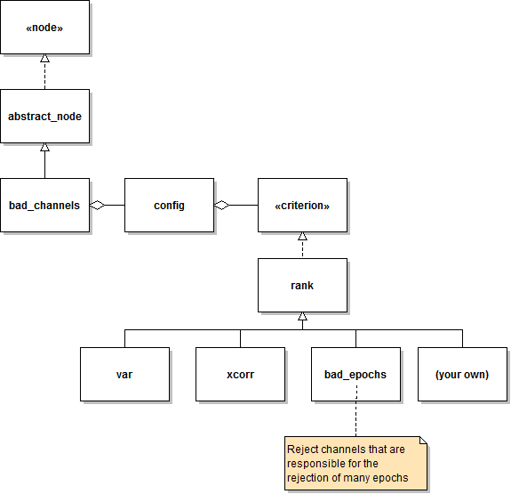

`bad_channels` node - Implementation details
 ===

A class diagram depicting the most relevant classes involved in the
implementation of `bad_channels` nodes is shown below.

If you don't know how to interpret the diagram above, you may want to
read some background information on [UML class diagrams][class-diagrams].
Otherwise, a simple interpretation is provided below. The definitions and
implementations of all classes in the diagram can be found within the
`bad_channels`'s node package: [+meegpipe/+node/+bad_channels][bad-chans-pkg].

[class-diagrams]: http://docs.kde.org/stable/en/kdesdk/umbrello/uml-elements.html#class-diagram
[bad-chans-pkg]: ./

You can understand the class diagram above as follows:

* The main class involved is the `bad_channels` class, whose definition and
  implementation is found under
 [+meegpipe/+node/+bad_channels/@bad_channels][bad_channels-class]. However,
 class `bad_channels` inherits some properties and methods from the
 [abstract_node class][node-api].

* Class `bad_channels` contains an object of class [config][config-class].
  The latter takes care of defining the configuration options that
  `bad_channels` nodes take. It also takes care of validating the values
  that users set for those configuration options.

* One of the configuration options (in fact, the _only_ configuration
  option) of `bad_channel` nodes is the `Criterion` option, which takes
  as its value a [criterion][criterion-ifc] object. Such object defines
  the criterion that is used to determine whether a channel is bad or not.

* Class `criterion` is not a [concrete class][absconcr] (i.e. you
  cannot create an instance of class `criterion`) but an [interface][ifc],
  meaning that `criterion` simply defines a set of methods that
  are to be implemented by its children classes (i.e. by the classes that
  _implement_ the `criterion` interface).

* Users can implement custom criteria by defining a class that implements
  the `criterion` interface (i.e. that inherits from class `criterion`).
  However, most users will want to inherit from class [rank][rank-class],
  which defines a generic criterion that sorts individual channels
  according to certain _rank index_ and considers to be bad any channel
  that has extreme _rank index_ values.

* There are various methods to define the _rank index_ that the `rank`
  criterion uses to identify bad channels. At this point, _meegpipe_
  offers the possibility of choosing between two methods, which are
  implemented by classes [var][var] and [xcorr][xcorr]. More details can be
  found in the documentation of those two classes.

[absconcr]: http://en.wikipedia.org/wiki/Class_(computer_programming)#Abstract_and_Concrete
[ifc]: http://en.wikipedia.org/wiki/Class_(computer_programming)#The_concept_of_class_interface
[criterion-ifc]: ./%2Bcriterion/criterion.m
[config-class]: ./config.m
[rank-class]: ./%2Bcriterion/%2Brank
[bad_channels-class]: ./%40bad_channels
[var]: ./%2Bcriterion/%2Bvar
[xcorr]: ./%2Bcriterion/%2Bxcorr

