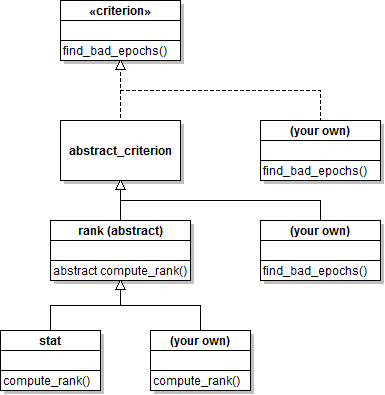

`criterion` package
===

In this document we will refer to this package as the `criterion` package
instead of its fully qualified name `meegpipe.node.bad_epochs.criterion`.

The `criterion` package contains MATLAB classes implementing various
epoch rejection criteria. All such criteria implement the
[criterion interface][crit-ifc], which must also be implemented by any
user-defined criteria.

[crit-ifc]: ./criterion.md

## Available criteria

Criterion       | Description
--------------- | -------------
[stat][stat]    | Reject epochs using simple epoch statistics

[stat]: ./+stat/README.md

## Implementation details

The contents of this package are organized according to the following class
hierarchy:

