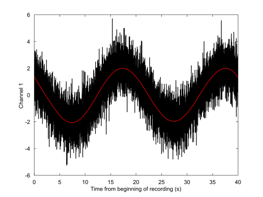

`filter` - Digital filter node
====

The `filter` filter the input `physioset` using a time-domain filter.


## Usage synopsis

````matlab
import meegpipe.*;
obj = node.filter.new('key', value, ...);
data = run(obj, data);
````

where `data` is a [physioset][physioset] object.

[physioset]: https://github.com/germangh/matlab_physioset/blob/master/%2Bphysioset/%40physioset/README.md


## Construction arguments

The `filter` node admits all the key/value pairs admitted by the
[abstract_node][abstract-node] class. For keys specific to this node
class see the documentation of the helper [config][config] class.

[abstract-node]: ../@abstract_node/README.md
[config]: ./config.md


## Default constructors


### `detrend`

The `detrend` default constructor will build a node that is suitable for 
removing very low frequency trends from the node input. See the Usage 
Examples at the end of this document for a usage example of this default
constructor.


## Methods

See the documentation of the [node API documentation][node].

[node]: ../


## Usage examples

The example below assume that _meegpipe_ has been initialized using:

````matlab
clear all;
meegpipe.initialize;
````


### Remove very low frequency trends

Very low frequency trends in the data can be effectively removed using 
a polynomial fitting filter. The latter fits a polynomial and subsequenty
removes such polynomial fit from the input data. This can be implemented
as follows:

````matlab
% Generate some sample data
import physioset.import.matrix;
data = import(matrix, randn(10, 10000));

% Add artificial (high amplitude) trends to the data
for i = 1:size(data,1)
    freq = 1/(3000+randi(3000));
    lag = randi(3000);
    t = 1:size(data,2);
    trend = sin(2*pi*freq*(t+lag));
    data(i,:) = data(i,:) + 2*trend;
end

% Build the filter node. Note that filter.detrend is just a default 
% constructor for filter nodes. See edit meegpipe.node.filter.detrend for
% more details
import meegpipe.node.*;
myNode = filter.detrend;

% Remove the low frequency trends
run(myNode, data);

% This assertion would have failed before performing the detrending
assert(var(data(1,:)) < 2)

````

The figure below has been taken from the generated HTML report and shows 
the first channel of the input to the node (in black) and the corresponding
polynomial fit (in red). The latter has been substracted to the input data
in order to produce the node output.




## More information

Information regarding available low-level filters and instructions
on how to define your own criterion can be found in the documentation of
the [filter package][filter-pkg].

[filter-pkg]: https://github.com/germangh/matlab_filter/tree/master/+filter/README.md
