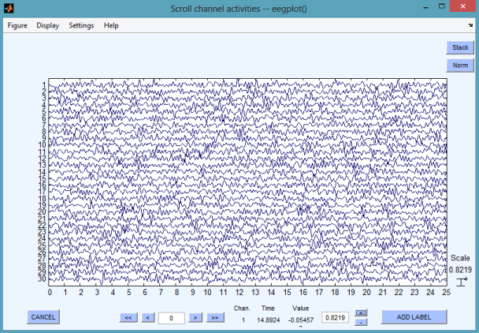
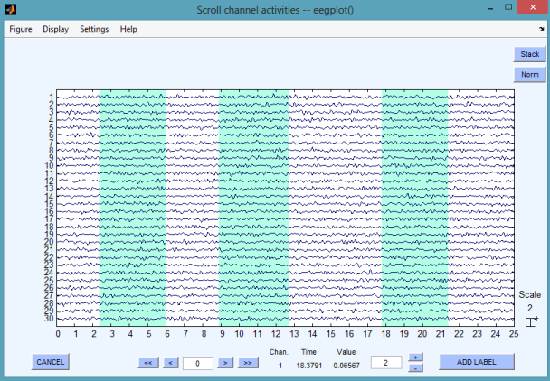
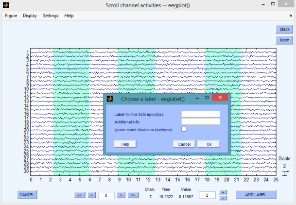

`subset` - Extract physioset subset
====

`subset` nodes create a new physioset based on a subset of the input
physioset.


## Usage synopsis

````matlab
import meegpipe.*;
obj = node.subset.new('key', value, ...);
data = run(obj, data);
````

where `data` is a [physioset][physioset] object.

[physioset]: https://github.com/germangh/matlab_physioset/blob/master/%2Bphysioset/%40physioset/README.md


## Construction arguments

The `subset` node admits all the key/value pairs admitted by the
[abstract_node][abstract-node] class. For keys specific to this node
class see the documentation of the helper [config][config] class.

[abstract-node]: ../@abstract_node/README.md
[config]: ./config.md


## Methods

See the documentation of the [node API documentation][node].

[node]: ../


## Usage examples

The example below assume that _meegpipe_ has been initialized using:

````matlab
clear all;
meegpipe.initialize;
````


### Concatenate event-marked data epochs


````matlab
% Generate some sample data
import physioset.import.matrix;
data = import(matrix, randn(30, 20000));

% We filter the data, just to be able to see the data discontinuities later
% on
myFilter = filter.lpfilt('fc', 0.05);
filter(myFilter, data);

% Add some dummy events of types 'ev1' and 'ev2'
import physioset.event.event;
ev1Array = event(500:1000:10000, 'Duration', 500, 'Offset', -100, 'Type', 'ev1');
ev2Array = event(1:1000:10000, 'Type', 'ev2');
add_event(data, ev1Array);
add_event(data, ev2Array);

% Events of type ev1 define our trials, so define an appropriate selector
import pset.selector.event_data;
myEvent = event(1, 'Type', 'ev1'); % The sample location is irrelevant
mySel = event_data(myEvent);

% Build a subset node that will use such selector
import meegpipe.node.*;
myNode = subset.new('SubsetSelector', mySel);

% Create a physioset based on the relevant data subset
dataSubset = run(myNode, data);

assert(all(size(dataSubset) == [30 5000]) & ...
    numel(get_event(dataSubset))==19);
% There are 4 events more than expected due to the disconuity events that
% were added by the subset node

% Plot the data, can you see the discontinuities between trials?
plot(dataSubset);

````


### Select and extract data epochs

Consider the case that we want to manually select multiple discontinuous 
epochs for further analysis, or to export to third-party toolboxes 
such as EEGLAB. This can be done using a rudimentary GUI which leverages 
EEGLAB's `eegplot` functionality. The steps involved are illustrated 
below.

First we generate some sample data:

````matlab
% Generate some sample data
import physioset.import.matrix;
data = import(matrix, randn(30, 20000));

% We filter the data, just to be able to see the data discontinuities later
% on
myFilter = filter.lpfilt('fc', 0.05);
filter(myFilter, data);
````

Now we can use the GUI to select the data epochs that are to be extracted. 
We do this by _adding events_ that mark the onset and duration of such 
data epochs:

````matlab
add_event(data);
````

The command above will open a GUI looking like the figure below:




You can now click, hold and release the mouse to select one or more data
epochs. The selected epochs will be marked with a light blue shade. See
the figure below for an example with three sample epochs:



Once you have selected al the epochs you want you should press the 
button __ADD LABEL__, which will open the following pop-up window:




Choose a unique label to identify your data epochs. You will need this 
label later when you extract the epochs from your dataset. In my case 
I used the label `myEpochs`. After clicking __OK__ on the pop-up window, 
the GUI closes. You can check that you indeed added three events to your 
physioset:

````matlab
myEv = get_event(data);
assert(numel(myEv) == 3);

% See that the first event 'Sample' and 'Duration' properties match the 
% onset and duration of your first epoch
dur = get_duration(myEv(1));
onset = get_sample(myEv(1));
````

If you made a mistake and want to remove some of the epoch-marking events, 
you can run:

````matlab
delete_event(data)
````

which will open a GUI where you can select one or more time windows (in the 
same way as you did with `add_event`). Any event whose onset falls within 
any of the selected windows will be removed from the physioset. 

Once we have created events to mark the onsets and durations of the epochs
that we want to extract from the data we can use a `subset` node to do the
extraction:

````matlab
% Events of type ev1 define our trials, so define an appropriate selector
import pset.selector.event_data;
myEvent = event(1, 'Type', 'myEpochs'); % The sample location is irrelevant
mySel = event_data(myEvent);

% Build a subset node that will use such selector
import meegpipe.node.*;
myNode = subset.new('SubsetSelector', mySel);

% Create a physioset based on the relevant data subset
dataSubset = run(myNode, data);
````


