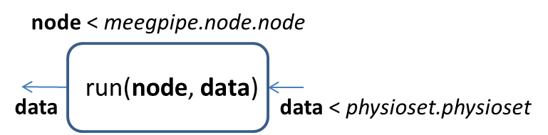
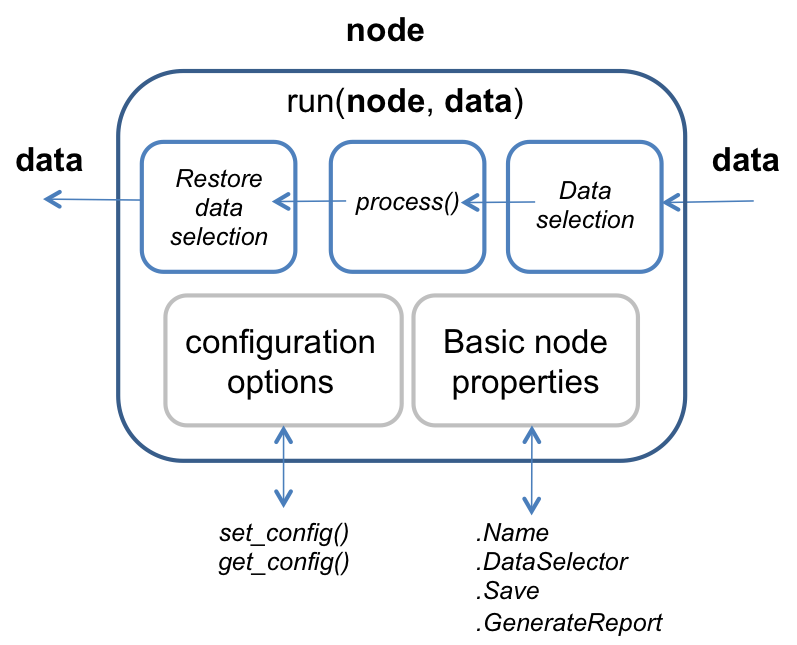

node API documentation
========

Package `+meegpipe/+node` contains definitions and implementations for
various _data processing nodes_. Every such node implements the
[node interface][meegpipe.node.node], meaning that you can operate all nodes
in an homogeneous manner. This also means that you can easily define your
own processing nodes and, as long as they implement the `node` interface,
they will naturally blend with other components of the _meegpipe_ framework.

A data processing node is an extremely simple abstraction:



A node object takes a single input (a [physioset][physioset] object), does
something to it (using method `run()`), and returns the processed data at
the output. It is important to realize that a node does not copy the input
data, but operates on the input data directly. See:

````matlab
% Generate some random data
myData = import(physioset.import.matrix, rand(4,10000));
assert(all(mean(myData,2) > 0.1));
myNode = meegpipe.node.center.center;
run(myNode, myData);
assert(~any(mean(myData,2) > 0.1));
````

[meegpipe.node.node]: ./node.m
[physioset]: https://github.com/germangh/matlab_physioset/blob/master/%2Bphysioset/%40physioset/physioset.m

## The abstract_node

All data processing nodes inherit some common functionality from class
[meegpipe.node.abstract_node][meegpipe.node.abstract_node]. This means that
the diagram below applies to all nodes, built-in and user-defined:




[meegpipe.node.abstract_node]: ./@abstract_node/README.md

The behavior of nodes is controlled with two different set of properties:
the _basic node properties_, and various _configuration options_.

### Basic node properties

The _basic node properties_ is a set of properties shared by
all nodes. The values of these properties can be set either during the
construction of the node or, once contructed, using the `.` operator. That
is, to build a `dummy` node whose `Save` property is set to true:

````matlab
myNode = meegpipe.node.dummy.new('Save', true);
````

Or you could have just built a default node and modify the `Save` property
afterwards:

````matlab
myNode = meegpipe.node.dummy.new
myNode.Save = true
````

There most important among the _basic node properties_ are:

* __Name__: A string that is used to identify the node (e.g. in the data
  processing HTML reports).
* __DataSelector__: A [pset.selector.selector][pset.selector.selector]
  object. This property is used to determine the subset of the input data
  that is to be actually processed. More information is available below.
* __Save__: A boolean value. If set to true, the output of the node will be
 saved to a disk file. By default `Save` if set to `false`.
* __GenerateReport__: A boolean value. If set to false then the node will
 generate only a minimal HTML report. This can speed up considerably the
 data processing at the expense of not allowing to inspect intermediate
 processing stages.

[pset.selector.selector]: https://github.com/germangh/matlab_pset/blob/master/%2Bpset/%2Bselector/selector.m


### Node configuration options

Apart from the _basic node properties_ listed above, a node may define an
arbitrary number of _configuration options_. Such options can be set either
during construction, or using method `set_config`. That is, to build a
`dummy` node whose `ConfigOpt1` is set to `1000`:

````matlab
myNode = meegpipe.node.dummy.new('ConfigOpt1', 1000)
````

and to modify the value of `ConfigOpt1` after construction:

````matlab
set_config(myNode, 'ConfigOpt1', 50000)
````

### Nodes are handle classes (aka references)

You may have noticed that, when modifying the configuration options of an
already constructed node, we did not write:

````matlab
myNode = set_config(myNode, 'ConfigOpt1', 50000)
````

but we simply wrote:

````matlab
set_config(myNode, 'ConfigOpt1', 50000)
````

The left hand side operand is not necessary because data processing nodes
are [handle MATLAB classes][handle-class]. In practice this just means that
nodes behave like [references][references]. That is:

````matlab
myNode = meegpipe.node.dummy.new;
myNode.Save = true
myNode2 = myNode
myNode2.Save = false
assert(~myNode.Save)
````

[handle-class]: http://www.mathworks.nl/help/matlab/handle-classes.html
[references]: http://en.wikipedia.org/wiki/Reference_(computer_science)


### Internal operation

Before performing any data processing, a node checks whether its
`DataSelector` property is not empty. In that case, it uses the data
selector to select a subset of the input data. Such subset is processed
using method `process()`, which must be defined by the final nodes'
classes, i.e. class `abstract_node` does not provide any kind of default
`process()` implementation. The data selection, if any, is undone after
the data has been processed.


## Defining new nodes

In this section we will use the `dummy` node to illustrate the process of
defining new data processing nodes. Every node must be wrapped by a
package. That is, every `.m` file related to node `dummy` is contained in
the [+meegpipe/+node/+dummy][meegpipe.node.dummy] directory.


### The node constructor

Within a node's package, one of the most important `.m` files is the node's
class definition file. The class definition for the `dummy` node is found
in [+meegpipe/+node/+dummy/@dummy/dummy.m][meegpipe.node.dummy.new].
Similarly, the class definition file for the `center` node is found in
[+meegpipe/+node/+center/@center/center.m][meegpipe.node.center.center].
The mandatory content of a node's class definition file is sketched below:

[meegpipe.node.dummy]: ./+dummy
[meegpipe.node.dummy.new]: ./+dummy/@dummy/dummy.m
[meegpipe.node.center.center]: ./+center/@center/center.m


````matlab
% Every node must inherit from meegpipe.node.abstract_node
classdef dummy < meegpipe.node.abstract_node

   methods
        % Method process() must be always defined. It is in process()
        % where the actual data processing takes place.
        data = process(obj, data)

    end

    % Constructor
    methods

        function obj = dummy(varargin)

            % This line must be present always
            obj = obj@meegpipe.node.abstract_node(varargin{:});

            if nargin > 0 && ~ischar(varargin{1}),
                % Copy constructor (must be present always!)
                return;
            end

            % Optional: define a default data selector for the node
            % E.g. if you wanted that, by default, nodes of class
            % dummy would process only good data (i.e. not bad channels
            % nor bad data samples) then you would use the code below:
            if isempty(get_data_selector(obj));
                set_data_selector(obj, pset.selector.good_data);
            end

            if isempty(get_name(obj)),
                % Set a default node name (typically the name of this
                % .m file, but not necessarily)
                obj = set_name(obj, 'dummy');
            end

        end

    end


end
````

### Define the configuration options of your node

The node configuration options for node `X` are defined in file
`+meegpipe/+node/+X/config.m`. That is, for the `dummy` node, they are
defined in file [+meegpipe/+node/+dummy/config.m][meegpipe.node.config].
Node `dummy` has two such options called `ConfigOpt1` and `ConfigOpt2`.
You can use [+meegpipe/+node/+dummy/config.m][meegpipe.node.config] as a
template for defining the configuration options of your node.

It is very important that you also write robust consistency checks that
ensure that the node configuration is valid. Note that the configuration of
the `dummy` node includes not only unit tests for each configuration
 option, but also a global test that ensures that the values of all options
are consistent with each other. Such global tests are not always necessary
though.

[meegpipe.node.config]: ./+dummy/config.m

### Default node configurations

For complex nodes it is customary to provide one ore more _default_
configurations. The convention used in _meegpipe_ is to do this by writing
a function within the node package that creates a node with the desired
defaults. In the case of the `dummy` node, there is only one
default configuration, implemented in function
[meegpipe.node.dummy.new_default()][meegpipe.node.dummy.default_dummy].

[meegpipe.node.dummy.default_dummy]: ./+dummy/dummy_default.m

### The process() method

The `process()` method is responsible for the actual data processing. The
`process()` method of the `dummy` node can be found in file
[+meegpipe/+node/+dummy/@dummy/process.m][dummy-process].

[dummy-process]: ./+dummy/@dummy/process.m


## Working with nodes

### Creating the node

Typically, you will set all the configuration options (and basic properties)
of a node during construction. For instance, to create a detrending node
that will detrend the data using a polynomial of order 10, and that will
save the processed result in a disk file:

````matlab
myNode = meegpipe.node.detrend.new('PolyOrder', 10, 'Save', true);
````

### Processing data

First we will create a random dataset for testing purposes:

````matlab
mySensors = sensors.eeg.from_template('egi256');
mySensors = subset(mySensors, 1:10:256);
myImporter = physioset.import.matrix('Sensors', mySensors);
data = import(myImporter, randn(26, 2000));
````

Now we can process the data using the `detrend` node that we created in the
previous section:

````matlab
run(myNode, data);
````

### Data processing report

After running the command above you will probably get a warning saying
something like:

> <strong>Warning</strong>: A new session was created in folder 'session_1' <br>
> In session.session>session.instance at 82 <br>
>  In pset.generate_data at 35 <br>
>  In matrix.import at 62 <br>

This means that _meegpipe_ created a directory `session_1`, which was used
used to store, among other things, the data processing report. Namely, the
main page of the report is:

    session_1/[DATA].meegpipe/[NODE]_[USR]_[SYS]/remark/index.htm

where

* __DATA__ is a string identifying the processed [physioset][physioset].
 Use method `get_name()` to find out the name of a [physioset][physioset]
 object. Random physiosets like the one used in the example are
 automatically assigned a random alphanumeric name. If the data would have
 been imported from a disk file, the file name would have been used as the
 physioset name. You can always modify the name of a `physioset` object
 using method `set_name()`.

* __NODE__ is a string identifying the _processing node_. It is a
 combination of the node name and a hash code that summarizes the node
 configuration. You can get the name of a node using method `get_name()`
 and you can modify it using `set_name()`.

* __USR__ is just the name of the user that ran command `run()`.

* __SYS__ is a string identifying the operating system and MATLAB version
 (e.g. _PCWIN64-R2011b_).


### Reading/exporting the processing results

The data processing report includes a code snippet that you can use to load
the data processing results into MATLAB. You can find it under the
_output report_ page. For the detrending example that we showed above, the
 code snippet reads:

````matlab
data = pset.load(['C:\Users\gomez\Dropbox\work\repo\workdir\' ...
    'session_1\20130410T165750_9a78a.meegpipe\' ...
    'detrend-c8181d_gomez_PCWIN64-R2011b\remark\node-output.pseth'])
````

The results are stored as a pair of `.pseth`/`.pset` files. The latter
contains the actual data values while the former contains all the
meta-information associated with the physioset.

You can now plot the data:

````matlab
select(data, 1:5); % Select the first 5 channels
plot(data);        % Plot selected channels
````

Or you can export it to EEGLAB's or Fieltrip's data formats:

````matlab
% Export to EEGLAB
myEEGLABStr = eeglab(data);
% Export to Fieldtrip
myFTripStr = fieldtrip(data);
````

See the documentation of the [physioset][physioset] data structure for
more information.

[physioset]: ../../+physioset/README.md


### Reproducing the processing results

_meegpipe_ should allow you to reproduce your analysis results perfectly.
Thus, you may consider deleting the processed data files after your
project has finalized. May you want to re-produce your results in the
future, you could do so by simply copying and pasting the relevant code 
snippet that you will find in the processing report. Such code may look 
like this:

````matlab
clear all; 

currDir = pwd; 

% Create a temporary dir to store the meegpipe version that was used to 
% produce these results
mkdir meegpipe_0cce21; 

cd meegpipe_0cce21; 

% Download meegpipe and check-out the relevant version
system('git clone git://github.com/meegpipe/meegpipe'); 
cd meegpipe; 
system('git checkout 4afd3df36ca62bc290424847953832f3a7b11f4b'); 

cd(['D:\data\pupw\' ...
    'pupw_0001_physiology_afternoon-sitting_1.meegpipe\' ...
    'pupillator-abp-e8ec45_gomez_PCWIN64-R2011b']); 

node = load('node.mat', 'obj'); 

input = load('input.mat', 'data'); 

cd(currDir) 

meegpipe.initialize; 

output = run(node.obj, input.data); 
````

## Built-in data processing nodes

Below you can find a list of the data processing nodes that are bundled
with _meegpipe_. The list may be outdated, and quite a few links will
surely be broken meaning that the corresponding docs have not been written
 yet.


Node                                | What for?
--------------------                | --------------------
[abp_beat_detect][abp-beat-detect]  | Detect beat onsets from Arterial Blood Pressure time-series
[abp_features][abp-features]        | Extract features from Arterial Blood Pressure time-series
[aregr][aregr-node]                 | (adaptively) regressing out a set of channels from another set of channels
[bad_channels][bad_channels-node]   | Reject bad channels
[bad_epochs][bad_epochs-node]       | Reject bad data epochs
[bss_regr][bss_regr-node]           | Removal of various types of artifacts: EOG, PWL, ECG, etc
[center][center-node]               | Remove data mean
[chan_interp][chan_interp-node]     | Interpolate bad channels
[chopper][chopper-node]             | Break physioset into various analysis windows (chops)
[copy][copy-node]                   | Create a copy of the input physioset
[dummy][dummy-node]                 | Dummy node to illustrate how to build your own processing nodes
[ecg_annotate][ecg_ann-node]        | Annotate heartbeats using the ECG
[erp][erp-node]                     | Compute average ERPs and extract ERP features
[ev_features][ev-features]          | Extract features (properties) from events
[ev_gen][ev-gen]                    | Event generation
[fix_event_time][fix-event-time-node] | Fix event timings by maximizing cross-correlation across epochs
[generic_features][generic-features]| Extract scalar features from data
[merge][merge]                      | Merge two or more physiosets
[mra][mra-node]                     | MR artifact correction using own (experimental) algorithm
[mra_fmrib][mra-fmrib-node]         | MR artifact correction using FMRIB's EEGLAB plug-in
[obs][obs-node]                     | Removal of [BCG artifacts][bcg-art] using [Optimal Basis Sets][obs-doc]
[physioset_import][phys_import-node]| Construct a physioset from a disk file
[physioset_export][phys-export]     | Export physioset to a disk file
[pipeline][pipeline-node]           | Define pipelines (a serial concatenation of nodes)
[qrs_detect][qrs_detect-node]       | Detect [QRS complexes][qrs-complex] from [ECG][ecg] lead
[reref][reref-node]                 | Re-referencing
[resample][resample-node]           | Re-sampling
[smoother][smoother-node]           | Smooth transitions between chops, epochs, etc
[spectra][spectra-node]             | Plot spectra and compute spectral features
[split][split-node]                 | Split input physioset into several physiosets
[subset][subset-node]               | Create physioset based on a sub-set of the input data
[tfilter][tfilter-node]             | Time-domain digital filtering

[abp-beat-detect]: ./+abp_beat_detect/README.md
[abp-features]: ./+abp_features/README.md
[aregr-node]: ./+aregr/README.md
[bad_channels-node]: ./+bad_channels/README.md
[bad_samples-node]: ./+bad_samples/README.md
[bad_epochs-node]: ./+bad_epochs/README.md
[bss_regr-node]: ./+bss_regr/README.md
[center-node]: ./+center/README.md
[chan_interp-node]: ./+chan_interp/README.md
[chopper-node]: ./+chopper/README.md
[copy-node]: ./+copy/README.md
[dummy-node]: ./+dummy/README.md
[ecg_ann-node]: ./+ecg_annotate/README.md
[erp-node]: ./+erp/README.md
[ev-gen]: ./+ev_gen/README.md
[ev-features]: ./+ev_features/README.md
[fix-event-time-node]: ./+fix_event_time/README.md
[generic-features]: ./+generic_features/README.md
[merge]: ./+merge/README.md
[mra-node]: ./+mra/README.md
[mra-fmrib-node]: ./+mra_fmrib/README.md
[obs-node]: ./+obs/README.md
[phys_import-node]: ./+physioset_import/README.md
[phys-export]: ./+physioset_export/README.md
[pipeline-node]: ./+pipeline/README.md
[qrs_detect-node]: ./+qrs_detect/README.md
[reref-node]: ./+reref/README.md
[resample-node]: ./+resample/README.md
[smoother-node]: ./+smoother/README.md
[spectra-node]: ./+spectra/README.md
[split-node]: ./+split/README.md
[subset-node]: ./+subset/README.md
[tfilter-node]: ./+tfilter/README.md

[bcg-art]: http://arno.uvt.nl/show.cgi?fid=88375
[ecg]: http://en.wikipedia.org/wiki/Electrocardiography
[qrs-complex]: http://en.wikipedia.org/wiki/QRS_complex
[obs-doc]: http://www.ncbi.nlm.nih.gov/pubmed/16150610