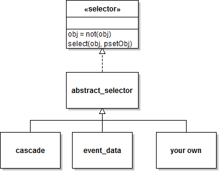

`selector` API documentation
====

Package `pset.selector` contains definitions of _data selector classes_. 
Objects of such selector classes can be used to select subsets of a 
[physioset][physioset] object using various criteria.

[physioset]: https://github.com/germangh/matlab_physioset/tree/master/+physioset/@physioset/README.md

Below you can find a diagram summarizing the class hierarchy contained in
the `selector` package:





All concrete data selector classes included in the `selector` package 
implement the [selector interface][selector-ifc]. Most (if not all) such 
classes do this by inheriting from class `abstract_selector`, which 
implements some very basic functionality shared among all concrete data 
selector classes. 

[selector-ifc]: ./selector.md


## Usage examples

Select good data samples from channels with labels `Fz` and `Cz`

````matlab
% Create a sample physioset
mySensors = sensors.dummy(4, 'Label', {'A1', 'Fz', 'Cz', 'A2'});
myImporter = physioset.import.matrix('Sensors', mySensors);
data = import(myImporter, randn(4, 10000));

% Set some bad data samples
 set_bad_sample(data, 100:200);

% Build the data selector object
mySel1 = pset.selector.good_samples;
mySel2 = pset.selector.sensor_label('Fz', 'Cz');
mySel  = pset.selector.cascade(mySel1, mySel2);

% Use the data selector to select the desired data subset
select(mySel, data);

assert(all(size(data) == [2, 9899]));
````


## Available data selectors

Below you can find a list of the standard data selection classes included 
in package `selector`. Users can easily implement their own custom 
selectors by implementing the [selector interface][selector-if] or, 
preferably, by inheriting from class `abstract_selector`.

Selector class          | Description
--------------          | ------------
[cascade][cascade]      | A cascade of two or more data selectors
[event_data][evdata]    | Select data using events information
[good_data][gooddata]   | Select good data samples and good data channels
[good_samples][goodsamp]| Select good data samples
[sensor_group_idx][sensgrp] | Select sensor group(s) by index
[sensor_idx][sensidx]   | Select sensor(s) by index
[sensor_label][senslab] | Select sensor(s) by label


[cascade]: ./cascade.md
[evdata]: ./event_data.md
[gooddata]: ./good_data.md
[goodsamp]: ./good_samples.md
[sensgrp]: ./sensor_group_idx.md
[sensidx]: ./sensor_idx.md
[senslab]: ./sensor_label.md


